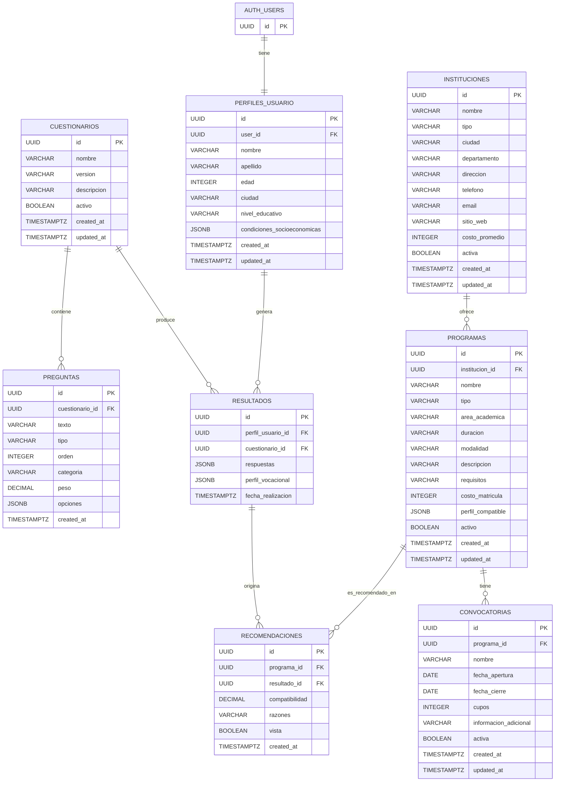

# 📊 Diagrama MER - Sistema Brota MVP

## Diagrama Entidad-Relación

## 📋 Resumen de Entidades

### Entidades Core (8 tablas MVP)

1. **AUTH_USERS** - Gestión de autenticación (Supabase)
2. **PERFILES_USUARIO** - Datos adicionales del estudiante
3. **INSTITUCIONES** - Instituciones educativas curadas
4. **PROGRAMAS** - Programas académicos ofrecidos
5. **CONVOCATORIAS** - Períodos de inscripción (separado de programas)
6. **CUESTIONARIOS** - Versiones del cuestionario vocacional
7. **PREGUNTAS** - Preguntas del cuestionario
8. **RESULTADOS** - Respuestas y perfiles generados
9. **RECOMENDACIONES** - Recomendaciones personalizadas

## 🔗 Relaciones Clave

### Cardinalidades:

- **AUTH_USERS → PERFILES_USUARIO**: 1:1 (un usuario tiene un perfil)
- **PERFILES_USUARIO → RESULTADOS**: 1:N (un usuario puede hacer múltiples cuestionarios)
- **CUESTIONARIOS → PREGUNTAS**: 1:N (un cuestionario tiene múltiples preguntas)
- **CUESTIONARIOS → RESULTADOS**: 1:N (un cuestionario produce múltiples resultados)
- **INSTITUCIONES → PROGRAMAS**: 1:N (una institución ofrece múltiples programas)
- **PROGRAMAS → CONVOCATORIAS**: 1:N ⚠️ CRÍTICO (un programa tiene múltiples convocatorias)
- **PROGRAMAS → RECOMENDACIONES**: 1:N (un programa aparece en múltiples recomendaciones)
- **RESULTADOS → RECOMENDACIONES**: 1:N (un resultado genera múltiples recomendaciones)

*Nota: La relación directa entre Perfiles de Usuario y Recomendaciones se eliminó para evitar relaciones circulares. Ahora de un Perfil se accede a Recomendación mediante sus Resultados correspondientes.*

## ✅ Validación del Modelo

### Decisiones Arquitectónicas Reflejadas:

✅ **Separación Programa-Convocatoria**: Implementada correctamente  
✅ **UUID como identificadores**: Todos los IDs son UUID  
✅ **Campos de auditoría**: created_at y updated_at en todas las tablas  
✅ **JSONB para flexibilidad**: perfil_vocacional, respuestas, condiciones_socioeconomicas  
✅ **Integración Supabase Auth**: AUTH_USERS separado de PERFILES_USUARIO  
✅ **Campo activa en convocatorias**: Para ocultamiento automático
✅ **Eliminación de Redundancias**: Se removieron dependencias circulares simplificando relaciones críticas.

### Entidades Fuera del MVP (No incluidas):

❌ MascotaIA  
❌ RutaAprendizaje  
❌ ContenidoRuta  
❌ ProgresoUsuario  
❌ Favorito  
❌ Comparacion
❌ Áreas de Estudio (Simplificado a un campo VARCHAR 'area_academica' en Programas)

---

## 🎨 Cómo Visualizar

### Opción 1: GitHub/GitLab

Este código Mermaid se renderiza automáticamente en archivos .md en GitHub y GitLab.

### Opción 2: Mermaid Live Editor

1. Ve a https://mermaid.live
2. Pega el código del diagrama
3. Exporta como PNG/SVG

### Opción 3: VS Code

Instala la extensión "Markdown Preview Mermaid Support" para ver el diagrama en VS Code.

### Opción 4: Herramientas Online

- dbdiagram.io
- draw.io (con plugin Mermaid)
- Lucidchart

---

## 📝 Notas de Implementación

Este diagrama refleja exactamente el esquema SQL actualizado y libre de relaciones circulares definido en `backend/modelo_datos.md` y `backend/setup_database.sql`.

Para implementar:

1. Ejecutar DDL en Supabase SQL Editor
2. Verificar relaciones y constraints
3. Configurar Row Level Security (RLS)
4. Poblar con datos de prueba

---

[← Volver a Backend](../backend/README.md) | [Ver Modelo de Datos Completo](../backend/modelo_datos.md)
